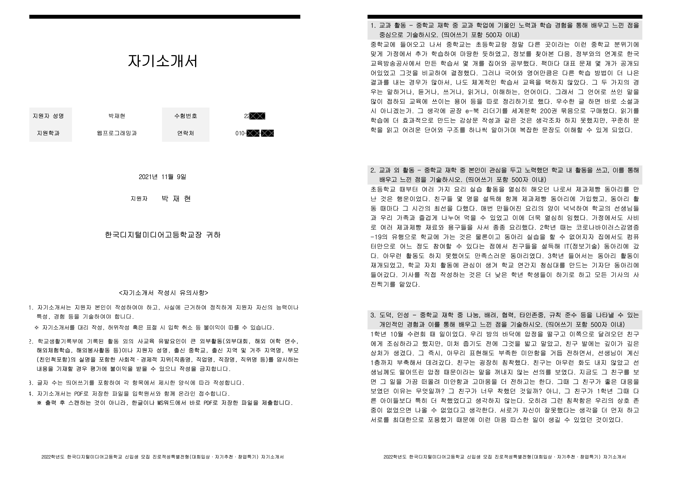
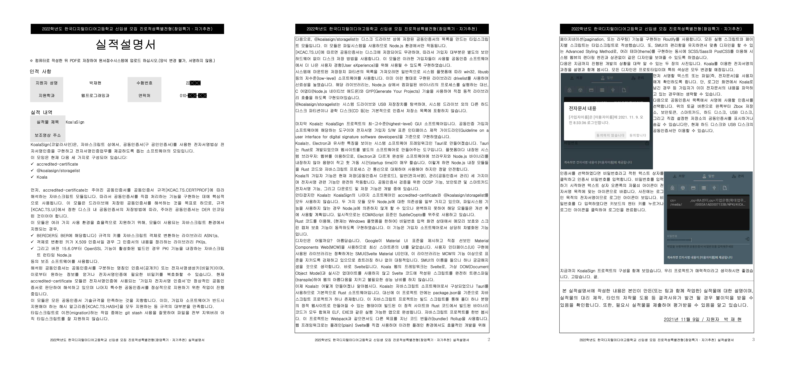
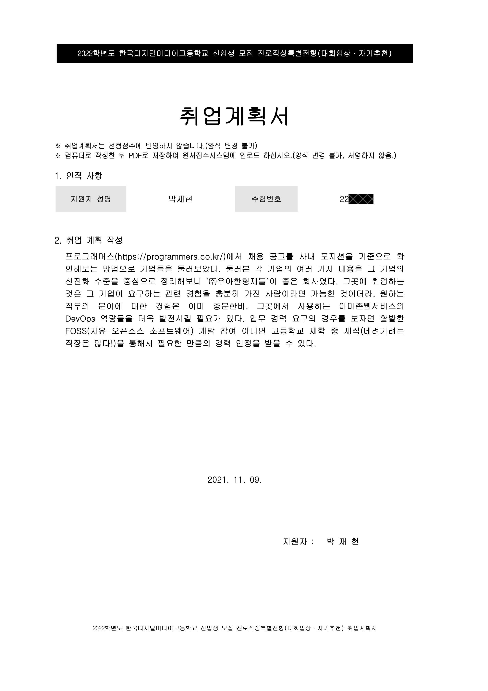

# 2022학년도 한국디지털미디어고등학교 신입생 모집 진로적성특별전형 (자기추천)

## License

This work © 2021 by Jaehyeon Park is licensed under [Creative Commons Attribution-NonCommercial-ShareAlike 4.0 International](https://creativecommons.org/licenses/by-nc-sa/4.0/).

### License of the original form

[Type 2: Source Indication + Commercial Use Prohibition](http://www.kogl.or.kr/info/licenseType2.do)

The user can freely use the public work without fee, and can change it to create secondary work, but it is not permitted to use for commercial purpose.

Jaehyeon Park is not affiliated with Korea Digital Media High School or any third-parties of this work. <!-- markdownlint-disable-line MD033 -->
